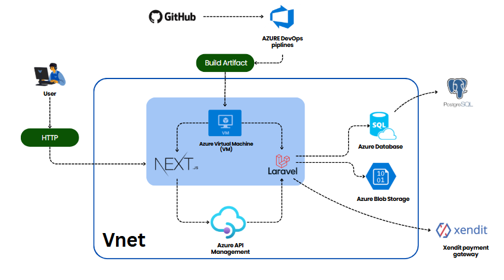

# 📘 HRIS - Human Resource Information System  
### cmlabs DEV Ecosystem x JTI Polinema  
🚀 *Project Based Learning 2025 Collaboration*

---

## 🧾 Overview

HRIS (Human Resource Information System) adalah aplikasi web dan mobile yang dirancang untuk mempermudah aktivitas tim HR dalam mengelola data kepegawaian. Fitur utama mencakup manajemen data karyawan, surat menyurat, absensi, lembur, serta langganan berbayar berbasis payment gateway (Xendit). Aplikasi ini diharapkan menjadi solusi modern dan efisien yang dapat bersaing dengan produk HRIS populer seperti Talenta, Gajihub, dan LinovHR.

---

## 🎯 Tujuan Akhir

1. ✅ Membangun aplikasi berbasis web dan mobile untuk pengelolaan HR modern.
2. 🧩 Mengimplementasikan fitur-fitur utama:
   - Manajemen data karyawan (data pribadi dan pekerjaan)
   - Manajemen dokumen legal dan riwayat kerja
   - Pengaturan dan pelaporan absensi
   - Pengaturan dan pelaporan lembur
   - Langganan berbayar dengan Xendit
3. ⚙️ Menyesuaikan penggunaan teknologi:
   - Frontend: **Next.js** + **TailwindCSS**
   - Backend: **Laravel**
   - Database: **MySQL**
   - Payment Gateway: **Xendit**
4. 📱 Menyediakan versi mobile berbasis **Flutter**

---

## 🧱 Diagram Arsitektur

### 🧩 Fungsi Utama Tiap Komponen

- **User**  
  ⤷ Mengakses aplikasi melalui browser (HTTP request).

- **Next.js (Frontend)**  
  ⤷ Menyajikan tampilan antarmuka (UI) ke user dan mengirim permintaan API ke backend.

- **Laravel (Backend)**  
  ⤷ Mengelola logika bisnis, autentikasi, data user, dan mengatur komunikasi dengan database, storage, dan payment gateway.

- **Azure Virtual Machine (VM)**  
  ⤷ Menjadi tempat hosting aplikasi frontend dan backend.

- **GitHub + Azure DevOps Pipelines**  
  ⤷ Digunakan untuk CI/CD: mengelola source code, build otomatis, dan deployment ke VM.

- **PostgreSQL (Azure Database)**  
  ⤷ Menyimpan seluruh data utama seperti data karyawan, absensi, dan riwayat lembur.

- **Azure Blob Storage**  
  ⤷ Menyimpan file dokumen seperti surat kerja, sertifikat, dan data berkas lainnya.

- **Azure API Management**  
  ⤷ Mengelola dan mengamankan API yang digunakan oleh aplikasi.

- **Xendit (Payment Gateway)**  
  ⤷ Menangani transaksi pembayaran dari user untuk langganan fitur aplikasi.

---

## 📦 Modul-Modul Utama

- **Authentication**: Login via email, ID karyawan, nomor telepon, dan Google OAuth.
- **Employee Management**: Manajemen data diri & pekerjaan karyawan.
- **Letter Management**: Dokumen legal, sertifikasi, evaluasi, dll.
- **Absensi (Check-Clock)**: Lokasi, jadwal kerja, laporan absensi otomatis.
- **Lembur (Overtime)**: Pengelolaan dan laporan lembur sesuai kebijakan perusahaan/pemerintah.
- **Pricing**: Sistem langganan Pay-as-you-go dengan Xendit.
- **Mobile App**: Versi ringan untuk karyawan yang mendukung absensi dan editing data.
---

## 🧑‍💻 Developer & Teknologi

| Layer       | Teknologi                                |
|-------------|-------------------------------------------|
| Frontend    |  |
| Styling     |  |
| Backend     |  |
| Database    |  |
| Payment     |  |

### 👥 Developer Team
| Nama                            | NIM           |
|---------------------------------|---------------|
| Ahmad Faza Alfan Fashlah       | 2241720186    |
| Mochammad Zakaro Al Fajri     | 2241720175    |
| Rio Bagas Hermawan       | 2241720193    |
| Sony Febri Hari Wibowo   | 2241720202    |